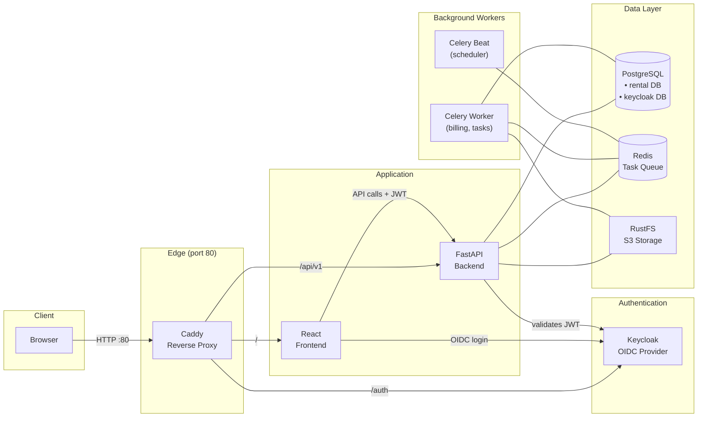
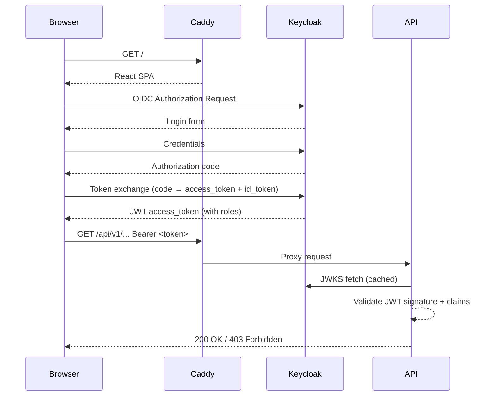
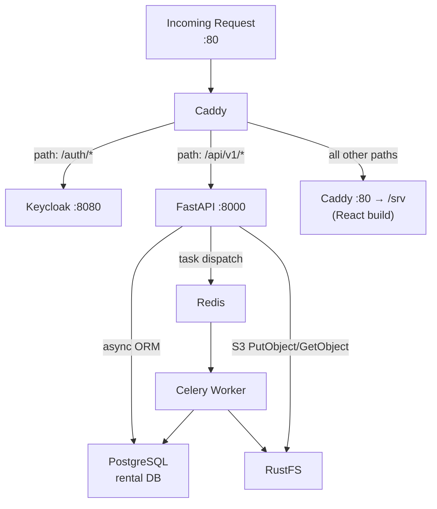
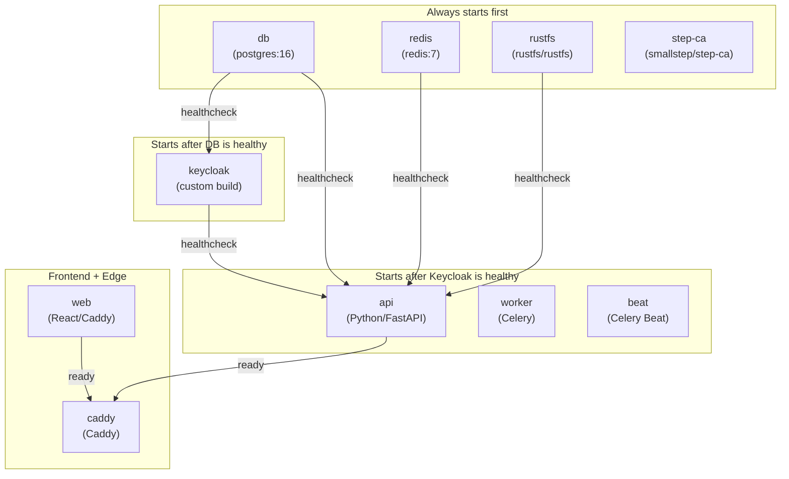

# Architecture

Rental Manager is a fully containerised, self-hosted application. All components run as
Docker services orchestrated by Docker Compose, fronted by a Caddy reverse proxy.

## System Overview

## Authentication Flow

## Request Routing

## Tech Stack

| Layer           | Technology            | Notes                                       |
| --------------- | --------------------- | ------------------------------------------- |
| Frontend        | React 18 + Vite       | OIDC via `oidc-client-ts`                   |
| Backend         | FastAPI + Python 3.12 | Async, `uvicorn`                            |
| Auth            | Keycloak 26           | Realm `rental`, OIDC/OAuth2                 |
| Database        | PostgreSQL 16         | Two databases: `rental_manager`, `keycloak` |
| Cache / Queue   | Redis 7               | Celery broker + result backend              |
| Object Storage  | RustFS                | S3-compatible, for documents                |
| Reverse Proxy   | Caddy 2               | Automatic HTTPS, routing                    |
| TLS CA          | step-ca               | Internal CA for local HTTPS                 |
| Dependency Mgmt | uv                    | Python lockfile-based installs              |
| Container       | Docker Compose v2     | Requires Docker API ≥ 1.44                  |

## Docker Services

