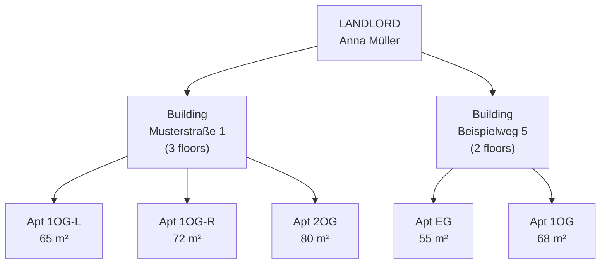
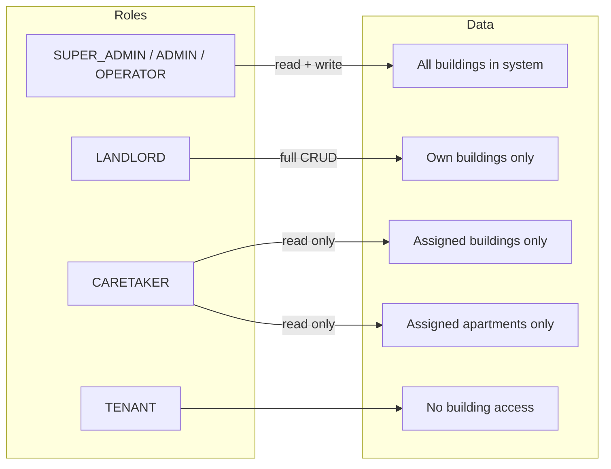
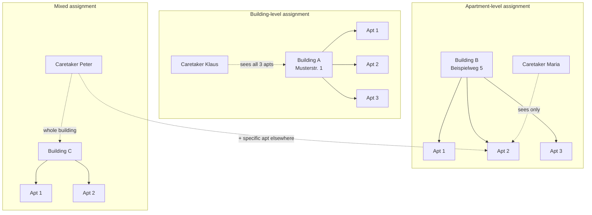
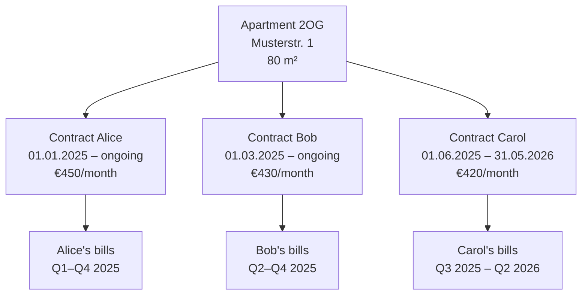

# Buildings & Apartments

Real estate in Rental Manager is modelled in two explicit layers:

| Concept   | DB/API Technical Name            | Description                     |
| --------- | -------------------------------- | ------------------------------- |
| Building  | `Property` (legacy) / `Building` | Physical building structure     |
| Apartment | `Unit` (legacy) / `Apartment`    | Rentable unit inside a building |

::: note API Compatibility
Both naming conventions are supported. Legacy endpoints (`/properties`, `/units`) remain
fully functional alongside the semantic aliases (`/buildings`, `/apartments`).
:::

## Two-Level Hierarchy



## Role Access to Buildings & Apartments



## Caretaker Assignment

Caretakers have a two-tier assignment model. A building-level assignment grants access
to all apartments within that building. An apartment-level assignment is more granular.



### Assignment API

```http
# Assign caretaker to a whole building
POST /landlord/buildings/{building_id}/caretakers/{caretaker_id}

# Remove building assignment
DELETE /landlord/buildings/{building_id}/caretakers/{caretaker_id}

# Assign caretaker to a single apartment
POST /landlord/apartments/{apartment_id}/caretakers/{caretaker_id}

# Remove apartment assignment
DELETE /landlord/apartments/{apartment_id}/caretakers/{caretaker_id}
```

## Shared Flats (WG / Wohngemeinschaft)

An apartment can have multiple active contracts simultaneously, one per tenant.
This enables individual billing for shared flats:



Each tenant receives their own utility bill based on their contract's share of
consumption. Meters are linked to the apartment; readings are shared across all
active contracts.

## API Endpoint Reference

| Method           | Path (semantic)                       | Path (legacy)                     | Description             |
| ---------------- | ------------------------------------- | --------------------------------- | ----------------------- |
| `GET/POST`       | `/landlord/buildings`                 | `/landlord/properties`            | List / create buildings |
| `GET/PUT/DELETE` | `/landlord/buildings/{id}`            | `/landlord/properties/{id}`       | Single building         |
| `GET/POST`       | `/landlord/buildings/{id}/apartments` | `/landlord/properties/{id}/units` | Apartments in building  |
| `GET/PUT/DELETE` | `/landlord/apartments/{id}`           | `/landlord/units/{id}`            | Single apartment        |
