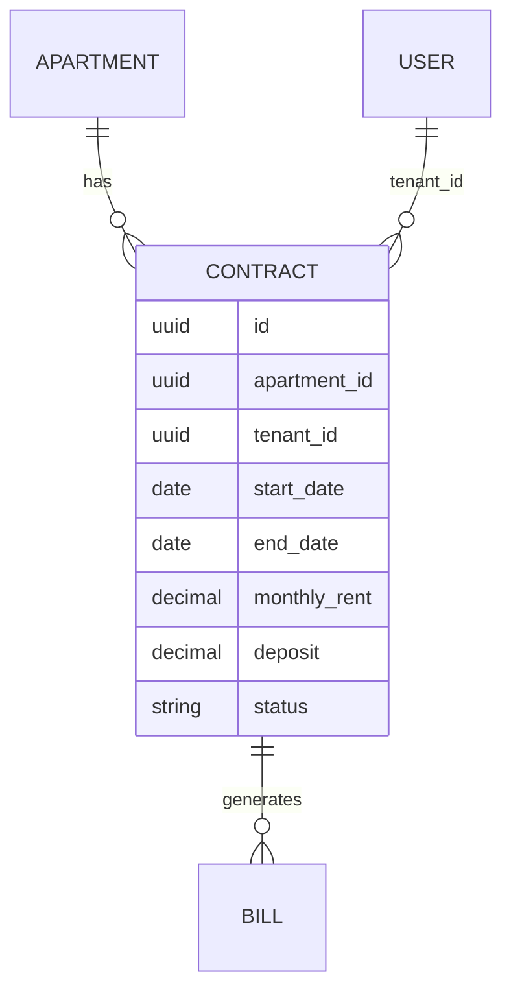
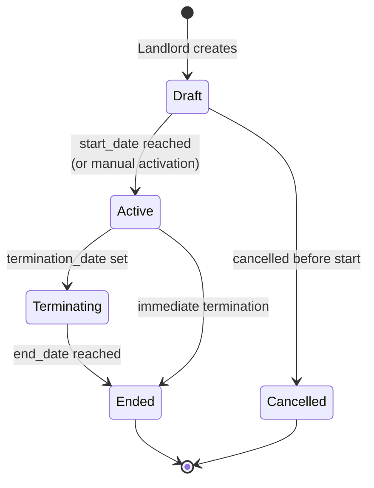
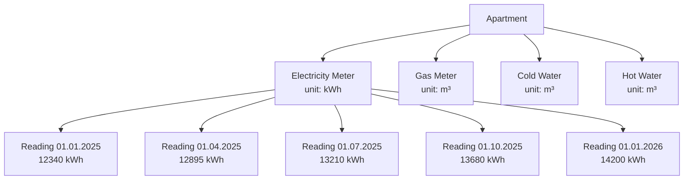
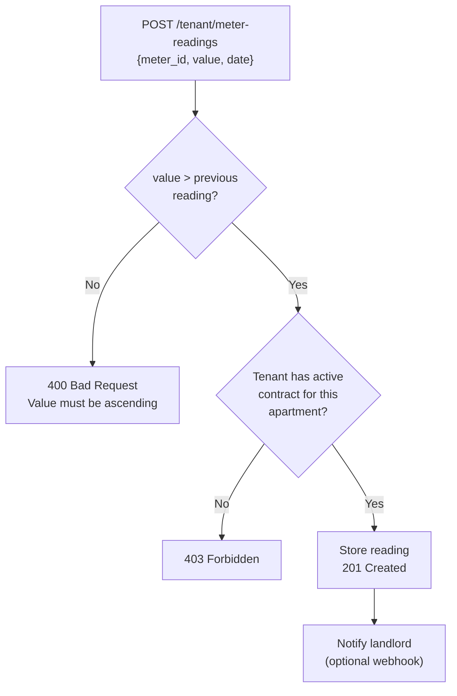
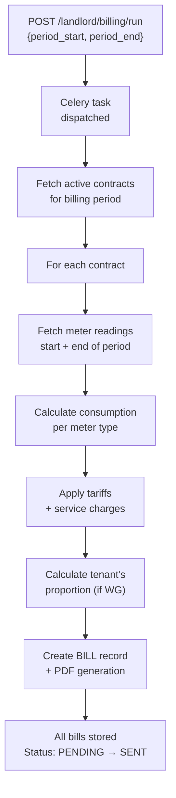
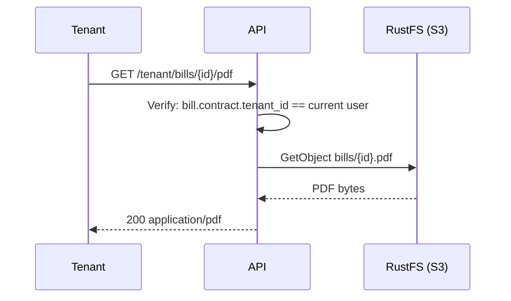

# Contracts & Billing

## Contract Model

A contract links a **tenant** to an **apartment** for a defined period and records the
agreed rent. There is no one-tenant-per-apartment restriction; multiple concurrent
contracts are supported for shared flats.

## Contract Lifecycle

## Meters & Readings

Each apartment can have multiple utility meters (electricity, gas, water, heat, etc.).
Readings are recorded either by the tenant (self-service) or by the landlord/caretaker.

### Meter Reading Validation

## Billing Calculation

Billing runs are triggered manually by the landlord or automatically by the Celery Beat
scheduler. A run covers a defined billing period and processes all apartments with
active contracts.

### Bill PDF Generation

Bills are stored as PDF files in the S3-compatible RustFS storage and can be
downloaded by both the landlord and the relevant tenant.

## Billing Period & Allocation

For shared flats, service charges (Nebenkosten) are allocated proportionally:

| Tenant | Contract Start | Monthly Rent | Share |
| ------ | -------------- | ------------ | ----- |
| Alice  | 01.01.2025     | €450         | 33 %  |
| Bob    | 01.03.2025     | €430         | 33 %  |
| Carol  | 01.06.2025     | €420         | 34 %  |

The exact allocation model (equal shares vs. rent-weighted) is configurable per
billing run.

## API Reference

| Method     | Path                       | Description               |
| ---------- | -------------------------- | ------------------------- |
| `GET/POST` | `/landlord/contracts`      | List / create contracts   |
| `GET/PUT`  | `/landlord/contracts/{id}` | Get / update contract     |
| `GET/POST` | `/landlord/meters`         | List / create meters      |
| `POST`     | `/landlord/meter-readings` | Record a meter reading    |
| `POST`     | `/landlord/billing/run`    | Trigger billing run       |
| `GET`      | `/landlord/bills`          | List all bills            |
| `GET`      | `/landlord/bills/{id}/pdf` | Download bill PDF         |
| `GET`      | `/tenant/contracts`        | Tenant: own contracts     |
| `GET`      | `/tenant/bills`            | Tenant: own bills         |
| `GET`      | `/tenant/bills/{id}/pdf`   | Tenant: download own bill |
| `POST`     | `/tenant/meter-readings`   | Tenant: submit reading    |
