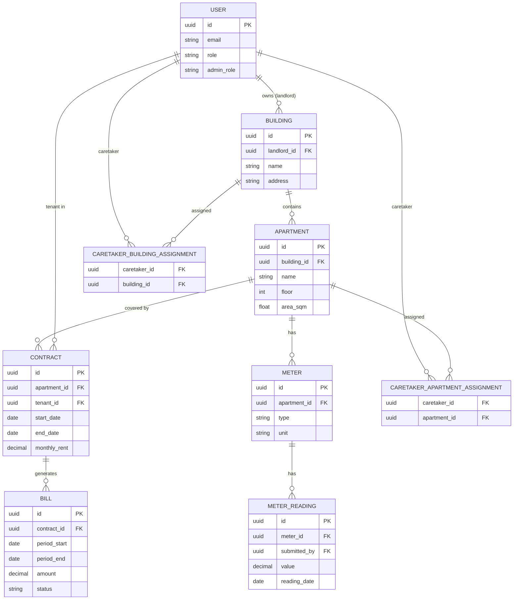

# Domain Model

Rental Manager's domain is built around a two-level property hierarchy and a
contract-centric tenancy model.

## Entity Relationship Overview

## Domain Sections

| Section                               | Description                                                  |
| ------------------------------------- | ------------------------------------------------------------ |
| [Buildings & Apartments](./buildings) | Property hierarchy, caretaker assignment model, WG scenarios |
| [Contracts & Billing](./contracts)    | Contract lifecycle, meter readings, billing calculation      |
