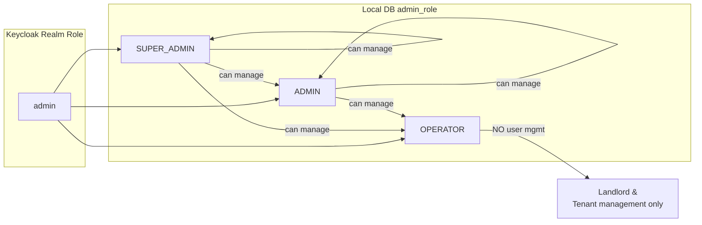
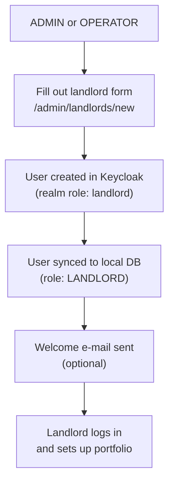
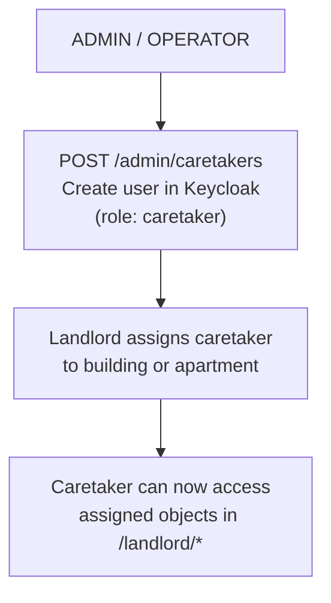

# Admin & Operator

The `ADMIN` role covers platform-level administration. It is subdivided into three
sub-roles that determine how much of the admin area a user can access.

## Sub-role Overview

## SUPER_ADMIN

The `SUPER_ADMIN` has full platform control including management of other
`SUPER_ADMIN` accounts. Typically only one or two accounts exist with this level.

**Can do everything an ADMIN can, plus:**

- Create / delete other `SUPER_ADMIN` accounts
- View platform-wide audit entries

**UI Sections:**

- `/admin/dashboard` – Platform overview
- `/admin/users` – All user management (all sub-roles)
- `/admin/landlords` – Landlord management

## ADMIN

`ADMIN` handles day-to-day platform administration. Cannot touch `SUPER_ADMIN` accounts.

**Permissions:**

- Create / edit / deactivate `ADMIN` and `OPERATOR` accounts
- Create and manage `LANDLORD` and `TENANT` accounts
- View all buildings, apartments and contracts (read-only)
- Trigger manual billing runs

**UI Sections:**

- `/admin/dashboard`
- `/admin/users`
- `/admin/landlords`

## OPERATOR

`OPERATOR` is a limited admin role focused on landlord and tenant onboarding.
Operators cannot manage admin-level users at all.

**Permissions:**

- Create / edit `LANDLORD` accounts
- Create / edit `TENANT` accounts
- View all buildings and apartments
- Assign caretakers to objects

**Cannot:**

- Access `/admin/users` for admin-role accounts
- Delete landlords with active buildings

## Typical Workflows

### Creating a new Landlord

### Creating a new Caretaker

