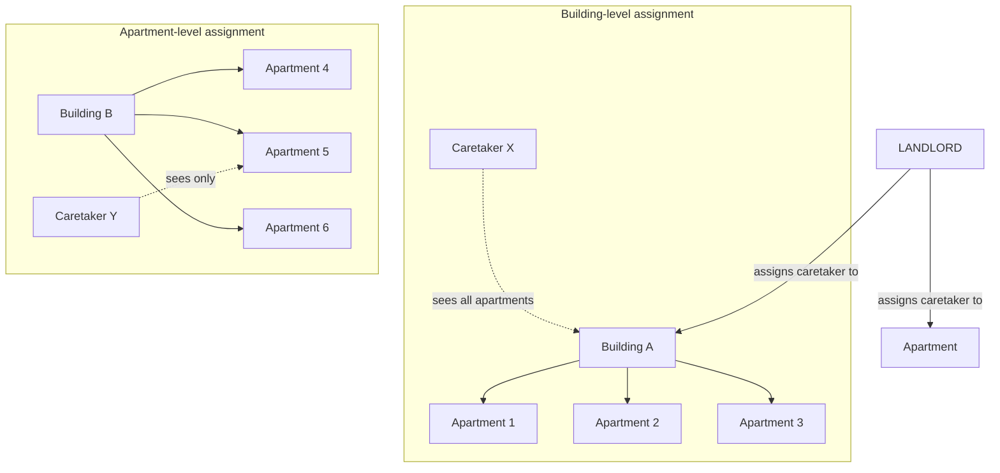
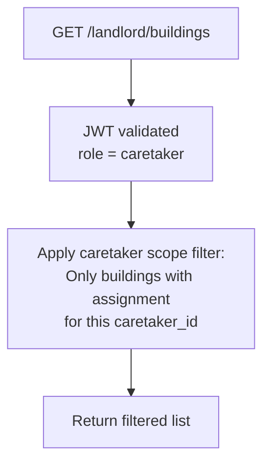
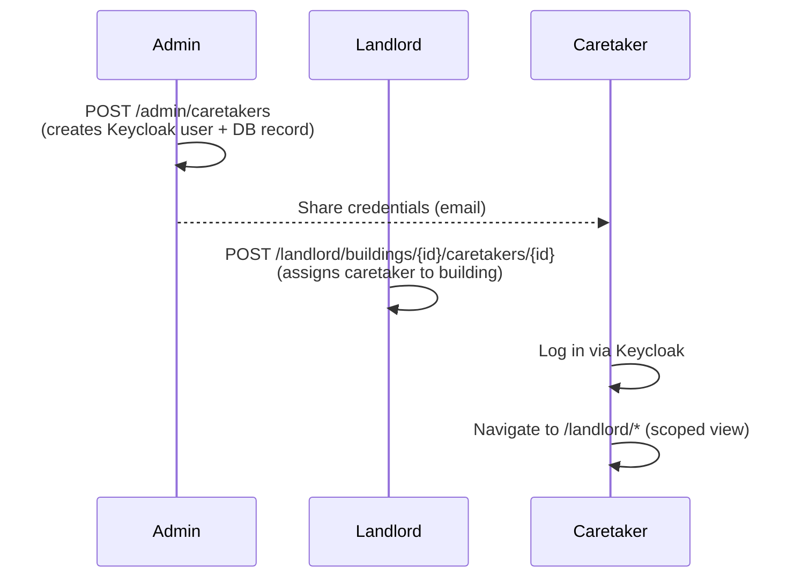

# Caretaker (Hausverwalter)

The `CARETAKER` role is designed for property managers (Hausverwalter) who act on behalf
of a landlord for specific buildings or apartments. It provides scoped access to the
landlord area without granting full landlord privileges.

## Key Characteristics

::: tip Scoped Access
A caretaker only sees data for objects they have been explicitly assigned to by the
landlord. They cannot see other buildings or apartments in the system.
:::

::: warning No Structural Changes
Caretakers cannot create new buildings, delete apartments, or manage other users.
Structural changes always require a landlord or admin account.
:::

## Assignment Model

Caretakers can be assigned at two levels of granularity:



### Assignment Endpoints

```
POST   /landlord/buildings/{building_id}/caretakers/{caretaker_id}
DELETE /landlord/buildings/{building_id}/caretakers/{caretaker_id}

POST   /landlord/apartments/{apartment_id}/caretakers/{caretaker_id}
DELETE /landlord/apartments/{apartment_id}/caretakers/{caretaker_id}
```

A caretaker can be assigned to multiple buildings and/or apartments across the same
landlord's portfolio.

## What a Caretaker Can and Cannot Do

| Action                                        | Caretaker |
| --------------------------------------------- | --------- |
| View assigned buildings                       | ✅        |
| View assigned apartments                      | ✅        |
| View active contracts for assigned apartments | ✅        |
| Record meter readings for assigned apartments | ✅        |
| View bills for assigned apartments            | ✅        |
| Create / delete buildings                     | ❌        |
| Create / delete apartments                    | ❌        |
| Manage tenants (invite, edit, deactivate)     | ❌        |
| Trigger billing runs                          | ❌        |
| Manage other caretakers                       | ❌        |
| Access admin area                             | ❌        |

## Access Flow



The scope filter is enforced at the dependency level (`require_landlord_or_caretaker`)
in the FastAPI route guards. Caretakers never receive unfiltered data even if they
construct API calls manually.

## Creating a Caretaker Account

Caretaker accounts are created by an admin or operator, then assigned by the landlord:


