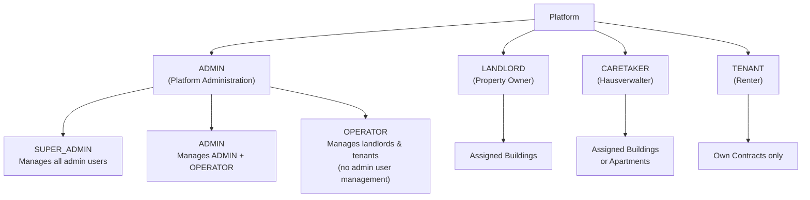

# Roles & Access Control

Rental Manager uses **role-based access control** via Keycloak realm roles. Each user has
exactly one top-level role, some with sub-roles for finer-grained permissions.

## Role Hierarchy

## Access Matrix

| Action                      | SUPER_ADMIN | ADMIN | OPERATOR | LANDLORD |   CARETAKER   |  TENANT  |
| --------------------------- | :---------: | :---: | :------: | :------: | :-----------: | :------: |
| Manage SUPER_ADMIN users    |     ✅      |  ❌   |    ❌    |    ❌    |      ❌       |    ❌    |
| Manage ADMIN users          |     ✅      |  ✅   |    ❌    |    ❌    |      ❌       |    ❌    |
| Manage OPERATOR users       |     ✅      |  ✅   |    ❌    |    ❌    |      ❌       |    ❌    |
| Manage landlords            |     ✅      |  ✅   |    ✅    |    ❌    |      ❌       |    ❌    |
| Create buildings/apartments |     ✅      |  ✅   |    ✅    | ✅ (own) |      ❌       |    ❌    |
| Assign caretakers           |     ✅      |  ✅   |    ✅    | ✅ (own) |      ❌       |    ❌    |
| View/manage all buildings   |     ✅      |  ✅   |    ✅    | ✅ (own) | ⚠️ (assigned) |    ❌    |
| Manage meters & readings    |     ✅      |  ✅   |    ✅    | ✅ (own) | ⚠️ (assigned) | ⚠️ (own) |
| View contracts & billing    |     ✅      |  ✅   |    ✅    | ✅ (own) | ⚠️ (assigned) | ✅ (own) |
| Submit meter readings       |     ✅      |  ✅   |    ✅    |    ✅    | ⚠️ (assigned) | ✅ (own) |

Legend: ✅ Full access · ⚠️ Scoped/limited access · ❌ No access

## Role Details

| Role                        | Area in UI    | Key Permissions                              |
| --------------------------- | ------------- | -------------------------------------------- |
| [Admin / Operator](./admin) | `/admin/*`    | Platform & user management                   |
| [Landlord](./landlord)      | `/landlord/*` | Own properties, tenants, billing             |
| [Caretaker](./caretaker)    | `/landlord/*` | Assigned objects only, no structural changes |
| [Tenant](./tenant)          | `/tenant/*`   | Own contracts, readings, bills               |

## Demo Accounts

| Role          | E-Mail                    | Password              |
| ------------- | ------------------------- | --------------------- |
| `SUPER_ADMIN` | super-admin@example.com   | SuperAdminTest2026    |
| `ADMIN`       | test-admin@example.com    | AdminTest2026         |
| `OPERATOR`    | test-operator@example.com | OperatorTest2026      |
| `CARETAKER`   | hausverwalter@example.com | HausverwalterTest2026 |
| `LANDLORD`    | demo-landlord@example.com | LandlordTest2026      |
| `TENANT`      | demo-tenant@example.com   | TenantTest2026        |
