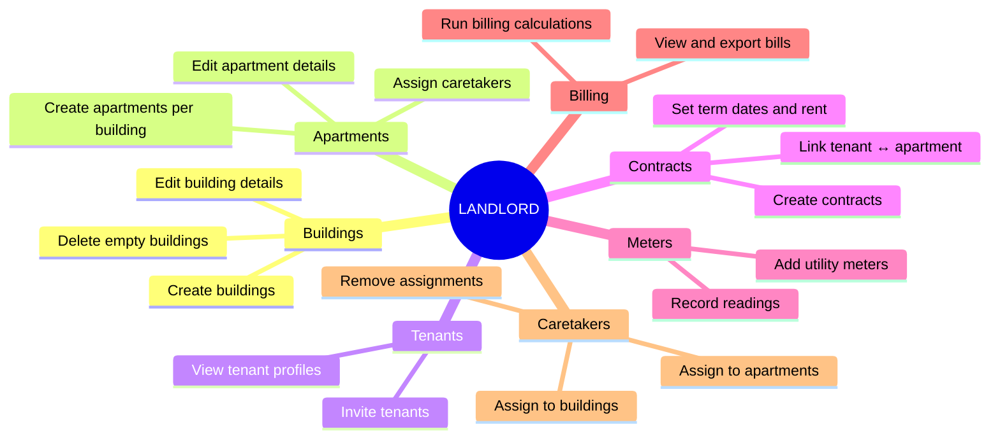
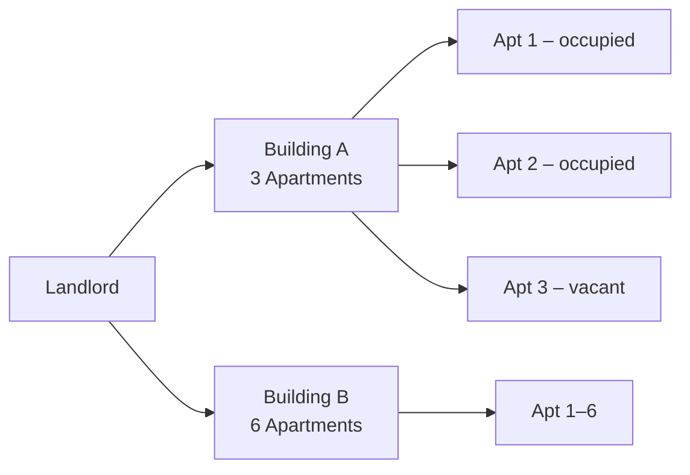
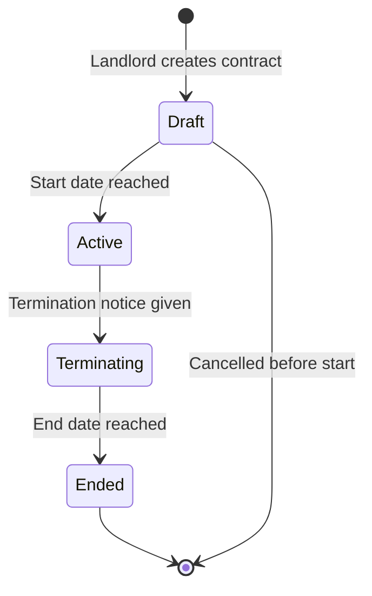
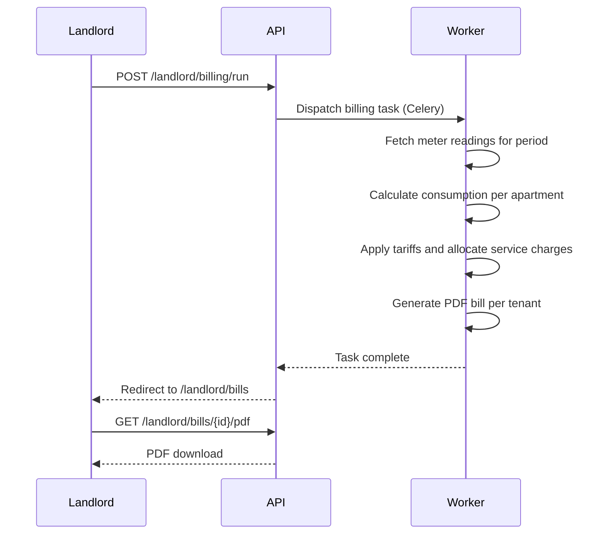

# Landlord

A `LANDLORD` manages their own real estate portfolio independently from other landlords.
All data (buildings, apartments, tenants, contracts, meters, billing) is strictly scoped
to the landlord who created it.

## What a Landlord Can Do

## Portfolio Overview

The landlord dashboard (`/landlord/dashboard`) shows a summary of:

- Total buildings and apartments
- Active vs. vacant apartments
- Pending meter readings
- Recent billing runs

## Managing Buildings & Apartments

See [Domain: Buildings & Apartments](../domain/buildings) for the full data model.

## Contract Lifecycle

## Billing Workflow

## API Reference (Landlord Area)

| Method           | Path                                  | Description                    |
| ---------------- | ------------------------------------- | ------------------------------ |
| `GET`            | `/landlord/dashboard`                 | Portfolio summary              |
| `GET/POST`       | `/landlord/buildings`                 | List / create buildings        |
| `GET/PUT/DELETE` | `/landlord/buildings/{id}`            | Get / update / delete building |
| `GET/POST`       | `/landlord/buildings/{id}/apartments` | List / create apartments       |
| `GET/PUT/DELETE` | `/landlord/apartments/{id}`           | Manage apartment               |
| `GET/POST`       | `/landlord/contracts`                 | List / create contracts        |
| `GET/POST`       | `/landlord/tenants`                   | List / invite tenants          |
| `GET/POST`       | `/landlord/meters`                    | List / create meters           |
| `POST`           | `/landlord/billing/run`               | Trigger billing run            |
| `GET`            | `/landlord/bills`                     | List bills                     |
