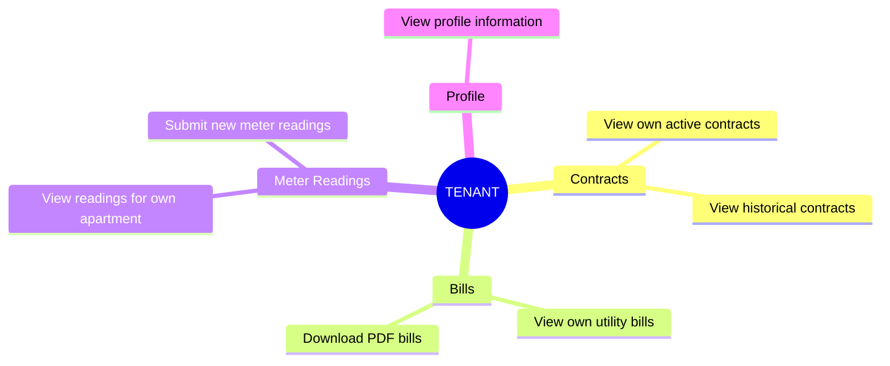
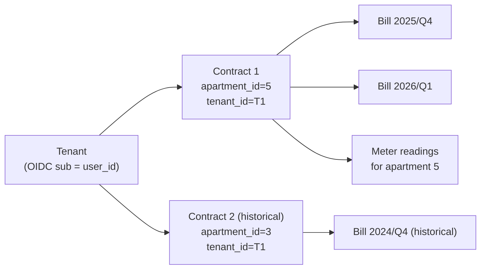
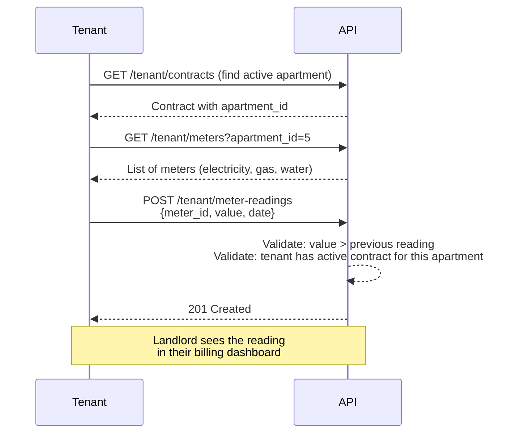
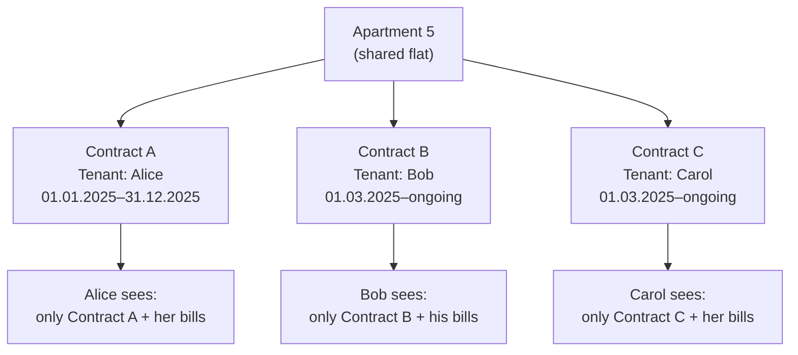

# Tenant

A `TENANT` has a self-service view of their own rental data. They cannot see other
tenants' data and have no access to administrative or landlord areas.

## What a Tenant Can Do

## Data Scope

A tenant's access is strictly limited to data linked to their own user account:

## Submitting Meter Readings

One of the key self-service features is meter reading submission:

## Tenant Area Navigation

| Page           | Path                     | Description                     |
| -------------- | ------------------------ | ------------------------------- |
| Dashboard      | `/tenant/dashboard`      | Upcoming bills, latest readings |
| Contracts      | `/tenant/contracts`      | All own contracts               |
| Bills          | `/tenant/bills`          | Utility bills with PDF download |
| Meter Readings | `/tenant/meter-readings` | Submit and view readings        |

## Multiple Tenants per Apartment (WG)

Rental Manager supports shared flats (Wohngemeinschaft). Each person in a WG has their
own individual contract linked to the same apartment:

Each tenant sees only their own contract and bills, even when sharing an apartment.
