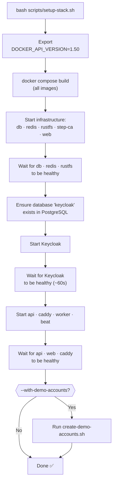
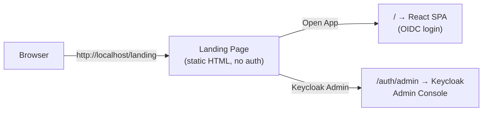

# Setup & Operations

## Prerequisites

- Docker Engine ≥ 24.x with Docker Compose v2
- Docker API version ≥ 1.44 (multi-network container support)
- Git

## Quick Start (Green Field)

```bash
git clone https://github.com/the78mole/vermeter.git
cd vermeter

# Start the full stack and create demo accounts
bash scripts/setup-stack.sh --with-demo-accounts
```

Once the script finishes, open the **landing page** first – it requires no login and gives you quick access to all services:

> **<http://localhost/landing>** ← Startseite des lokalen Stacks

## What `setup-stack.sh` Does



> **Note:** `docker compose up -d --build` alone does not work reliably because Keycloak
> starts before its PostgreSQL database is created and because Docker API ≥ 1.44 is
> required for containers with multiple network endpoints. The setup script handles both.

## Environment Variables

Copy `.env.example` to `.env` and adjust for your environment:

```bash
cp .env.example .env
```

| Variable                       | Default                  | Description                      |
| ------------------------------ | ------------------------ | -------------------------------- |
| `POSTGRES_USER`                | `rental`                 | PostgreSQL username              |
| `POSTGRES_PASSWORD`            | `rental_secret`          | PostgreSQL password              |
| `POSTGRES_DB`                  | `rental_manager`         | Application database name        |
| `KEYCLOAK_ADMIN`               | `admin`                  | Keycloak admin username          |
| `KEYCLOAK_ADMIN_PASSWORD`      | `admin_secret`           | Keycloak admin password          |
| `KEYCLOAK_REALM`               | `rental`                 | Keycloak realm name              |
| `KEYCLOAK_ADMIN_CLIENT_ID`     | `rental-backend`         | Backend service account client   |
| `KEYCLOAK_ADMIN_CLIENT_SECRET` | `backend_service_secret` | Backend service account secret   |
| `RUSTFS_ACCESS_KEY`            | `rustfsadmin`            | S3 access key                    |
| `RUSTFS_SECRET_KEY`            | `rustfs_secret`          | S3 secret key                    |
| `DOCKER_API_VERSION`           | `1.50`                   | Pinned Docker client API version |

## Teardown & Clean Restart

```bash
# Remove everything including volumes (full reset)
docker compose down -v --remove-orphans

# Green-field restart with demo accounts
bash scripts/setup-stack.sh --with-demo-accounts
```

## Access URLs

All services are served by Caddy on **port 80** (forwarded automatically in the dev container).

### Landing Page

The landing page at <http://localhost/landing> is a lightweight HTML overview page that does **not** require a login.
It shows quick-link buttons to the app and the Keycloak admin UI, and is the ideal first URL to open after setup.



### Full URL Overview (local dev container)

| URL                            | Service                       | Auth required?           |
| ------------------------------ | ----------------------------- | ------------------------ |
| <http://localhost/landing>     | Landing page                  | No                       |
| <http://localhost/>            | Rental Manager app            | Yes (OIDC)               |
| <http://localhost/auth/admin>  | Keycloak admin console        | Yes (Keycloak admin)     |
| <http://localhost/api/v1/docs> | FastAPI Swagger UI            | No (local)               |
| <http://localhost/rustfs>      | RustFS object-storage console | Yes (RustFS credentials) |

> All links above are **live** when the stack is running inside the dev container on Linux or in GitHub Codespaces (port 80 is forwarded to the host automatically).

### GitHub Codespaces

Replace `http://localhost` with `https://<codespace-name>-80.app.github.dev`.
Make sure port 80 visibility is set to **Public** (or **Organisation**) so the browser can reach it.

## Dev Container (VS Code / GitHub Codespaces)

The repository ships a fully configured dev container.

| Setting             | Value                                               |
| ------------------- | --------------------------------------------------- |
| Base image          | `mcr.microsoft.com/devcontainers/base:ubuntu-24.04` |
| Default shell       | ZSH · oh-my-zsh · theme **fino**                    |
| Docker              | Docker-outside-of-Docker (host socket)              |
| Required Docker API | **1.50**                                            |

After the dev container starts, run:

```bash
bash scripts/setup-stack.sh --with-demo-accounts
```

### Lifecycle Scripts

| Script          | When                     | What it does                                                      |
| --------------- | ------------------------ | ----------------------------------------------------------------- |
| `postCreate.sh` | Once on container create | Copies `.env.example → .env`, `uv sync`, `npm ci`, sets ZSH theme |
| `postStart.sh`  | Every container start    | Shows status and helpful commands                                 |

## Backend Local Development (without Compose)

```bash
cd backend
uv sync
uv run uvicorn app.main:app --reload --host 0.0.0.0 --port 8000
```

Requires a running PostgreSQL, Redis and Keycloak (start infra only):

```bash
docker compose up -d db redis keycloak rustfs
```
