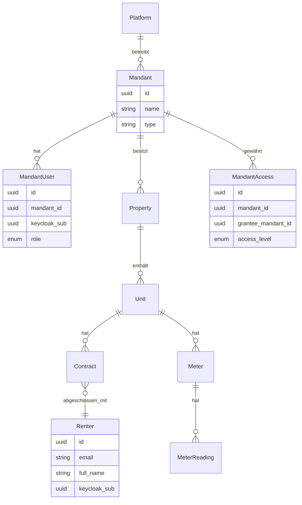
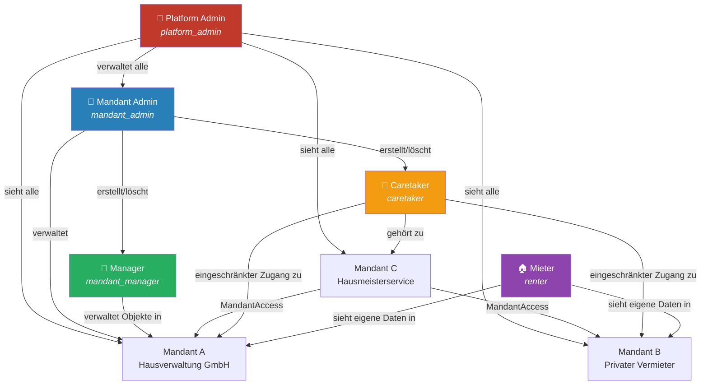
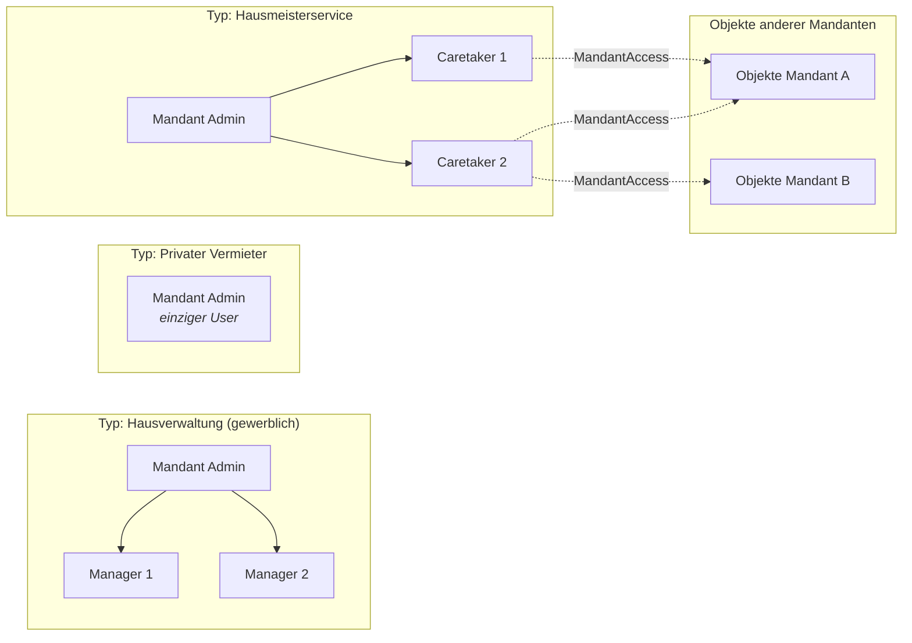
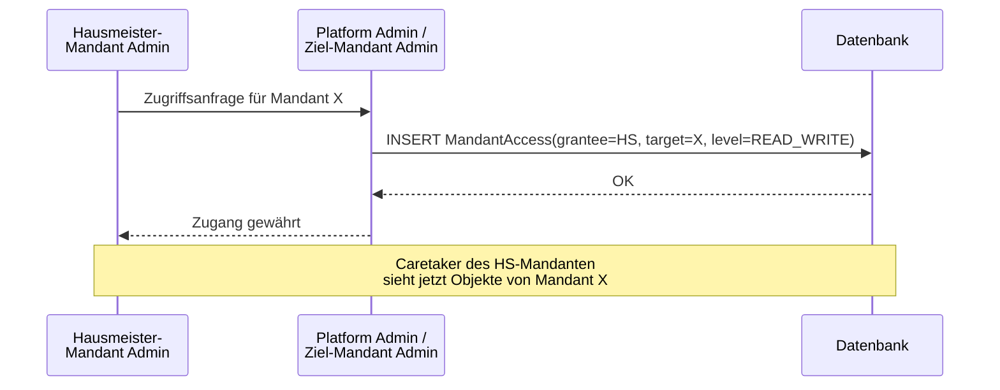

# Benutzerrollen & Mandantenstruktur

## Überblick

Der Rental Manager ist eine Mehrmandanten-Plattform (Multi-Tenant SaaS). Es gibt zwei
grundlegend verschiedene Nutzergruppen:

- **Plattform-Ebene**: Betreiber der Software
- **Mandanten-Ebene**: Kunden der Plattform (Hausverwaltungen, private Vermieter, Hausmeisterdienste)
- **Mieter-Ebene**: Endnutzer, die eine Wohneinheit gemietet haben

---

## Rollenübersicht

| Rolle          | Keycloak-Rolle    | Ebene                           | Beschreibung                                                |
| -------------- | ----------------- | ------------------------------- | ----------------------------------------------------------- |
| Platform-Admin | `platform_admin`  | Plattform                       | Zugang zu allen Mandanten, System-Konfiguration             |
| Mandant-Admin  | `mandant_admin`   | Mandant                         | Verwaltet seinen Mandanten und alle Benutzer darin          |
| Manager        | `mandant_manager` | Mandant                         | Normaler Vermieter-Benutzer; verwaltet Objekte und Verträge |
| Caretaker      | `caretaker`       | Mandant (mandantenübergreifend) | Hausmeister; lesen/schreiben in zugewiesenen Mandanten      |
| Mieter         | `renter`          | Mieter                          | Sieht eigene Verträge, Zählerstände und Abrechnungen        |

---

## Mandantenmodell

---

## Rollenbeziehungen und Zugriffsrechte

---

## Mandantentypen

---

## MandantAccess: Hausmeisterservice-Sonderfall

Ein Hausmeisterservice ist ein eigenständiger Mandant (`Typ: SERVICE_PROVIDER`).
Über die `MandantAccess`-Tabelle erhält er eingeschränkten Zugriff auf Objekte anderer Mandanten.

---

## Zugriffsmatrix

| Aktion                 | platform_admin | mandant_admin | mandant_manager | caretaker |   renter    |
| ---------------------- | :------------: | :-----------: | :-------------: | :-------: | :---------: |
| Mandanten verwalten    |       ✅       |      ❌       |       ❌        |    ❌     |     ❌      |
| Mandant-User erstellen |       ✅       | ✅ (eigener)  |       ❌        |    ❌     |     ❌      |
| MandantAccess vergeben |       ✅       | ✅ (eigener)  |       ❌        |    ❌     |     ❌      |
| Immobilien verwalten   |       ✅       |      ✅       |       ✅        |  👁️ read  |     ❌      |
| Verträge verwalten     |       ✅       |      ✅       |       ✅        |  👁️ read  |  👁️ eigene  |
| Zählerstände erfassen  |       ✅       |      ✅       |       ✅        |    ✅     | ✅ (eigene) |
| Nebenkostenabrechnung  |       ✅       |      ✅       |       ✅        |    ❌     |  👁️ eigene  |
| Mieter verwalten       |       ✅       |      ✅       |       ✅        |    ❌     |     ❌      |

---

## Begriffsdefinitionen

| Begriff               | Definition                                                                                                                                                              |
| --------------------- | ----------------------------------------------------------------------------------------------------------------------------------------------------------------------- |
| **Mandant**           | Organisationseinheit auf der Plattform (Kunde). Entspricht einem Unternehmen oder einer Privatperson als Vermieter.                                                     |
| **MandantUser**       | Login-fähiger Benutzer, der zu einem Mandanten gehört. Hat eine Rolle innerhalb des Mandanten.                                                                          |
| **Caretaker**         | Hausmeister. Gehört zu einem Dienstleister-Mandanten, hat aber delegierten Zugang zu Objekten anderer Mandanten.                                                        |
| **Mieter** (`Renter`) | Person, die eine Wohneinheit gemietet hat. Kann (optional) einen Keycloak-Account haben für Self-Service. Bewusste Abgrenzung von `Tenant` (= Mandant in SaaS-Kontext). |
| **MandantAccess**     | Delegierter, eingeschränkter Zugang eines Mandanten zu Objekten eines anderen Mandanten.                                                                                |
| **Property**          | Immobilie (Gebäude). Gehört zu einem Mandanten.                                                                                                                         |
| **Unit**              | Mieteinheit innerhalb einer Immobilie (Wohnung, Gewerbeeinheit).                                                                                                        |
